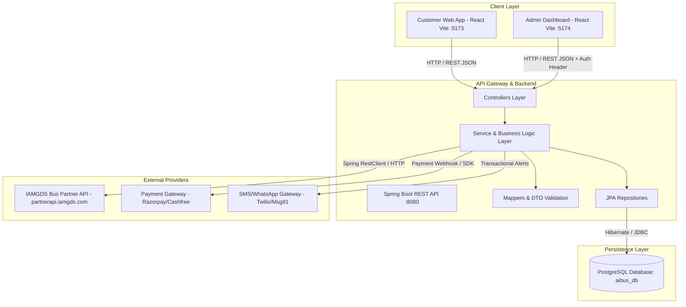
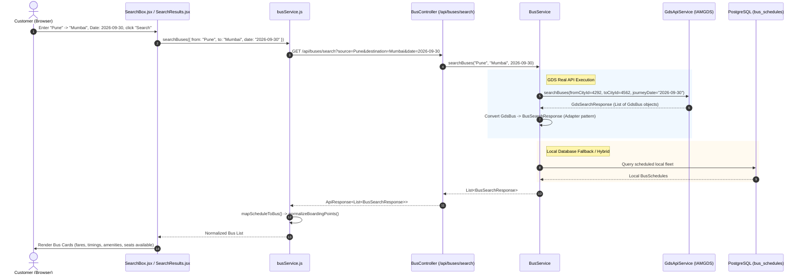
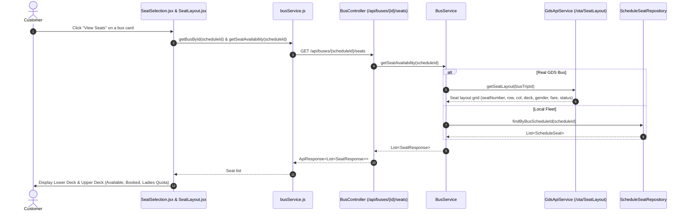
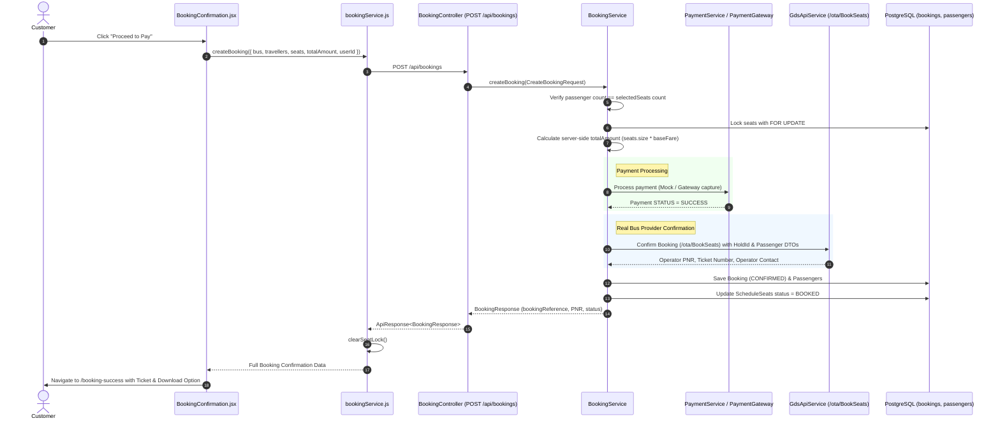
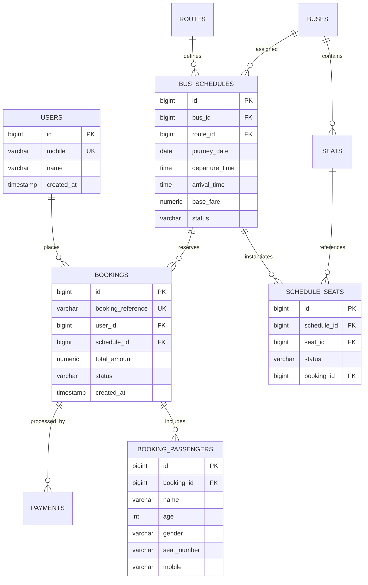

# AIBus - Complete System Architecture, Data Flow & Real API Integration Guide

> **Authoritative Guide for Development & Production Launch**  
> *Target Stack: React (Vite) + Spring Boot (Java 17) + PostgreSQL + IAMGDS Bus Partner API*

---

## 📑 Table of Contents
1. [System Architecture Overview](#1-system-architecture-overview)
2. [End-to-End User Journeys & Complete Data Flows](#2-end-to-end-user-journeys--complete-data-flows)
   - 2.1 [Bus Search & Results Flow](#21-bus-search--results-flow)
   - 2.2 [Bus Details & Seat Layout Flow](#22-bus-details--seat-layout-flow)
   - 2.3 [Seat Lock & Passenger Details Flow](#23-seat-lock--passenger-details-flow)
   - 2.4 [Booking Confirmation & Payment Flow](#24-booking-confirmation--payment-flow)
   - 2.5 [Ticket Cancellation & Refund Flow](#25-ticket-cancellation--refund-flow)
   - 2.6 [OTP Authentication Flow](#26-otp-authentication-flow)
3. [Deep Dive: Backend Classes & Methods Directory](#3-deep-dive-backend-classes--methods-directory)
   - 3.1 [Controllers Layer](#31-controllers-layer)
   - 3.2 [Services Layer](#32-services-layer)
   - 3.3 [Repositories Layer & JPA Queries](#33-repositories-layer--jpa-queries)
   - 3.4 [Entities & Database Schema](#34-entities--database-schema)
   - 3.5 [DTOs & Mappers](#35-dtos--mappers)
4. [Deep Dive: Frontend Architecture & Services](#4-deep-dive-frontend-architecture--services)
   - 4.1 [Service Layer (`busService.js`, `bookingService.js`, `api.js`)](#41-service-layer)
   - 4.2 [Pages & Component Hierarchy](#42-pages--component-hierarchy)
5. [Real Bus API (IAMGDS) Integration Blueprint](#5-real-bus-api-iamgds-integration-blueprint)
   - 5.1 [Understanding the IAMGDS API Workflow](#51-understanding-the-iamgds-api-workflow)
   - 5.2 [City Master / City ID Resolution](#52-city-master--city-id-resolution)
   - 5.3 [Data Mapping: GDS Models -> AIBus Domain Models](#53-data-mapping-gds-models---aibus-domain-models)
   - 5.4 [Fixing the Backend Compilation Errors (Lombok & Types)](#54-fixing-the-backend-compilation-errors-lombok--types)
   - 5.5 [Seat Layout & Real-time Hold / Block API](#55-seat-layout--real-time-hold--block-api)
   - 5.6 [Final Ticket Booking & PNR Generation](#56-final-ticket-booking--pnr-generation)
6. [Production Readiness & Launch Checklist](#6-production-readiness--launch-checklist)
   - 6.1 [Security & Token Management](#61-security--token-management)
   - 6.2 [Caching Strategy for High Performance & Cost Reduction](#62-caching-strategy-for-high-performance--cost-reduction)
   - 6.3 [Failure Handling & Edge Cases (Payment Debited vs Ticket Failed)](#63-failure-handling--edge-cases)
   - 6.4 [Deployment & Monitoring Strategy](#64-deployment--monitoring-strategy)

---

## 1. System Architecture Overview

AIBus is a modern bus booking aggregator platform designed with a clean 3-tier decoupled architecture:



### Key Components:
1. **Customer Frontend (`customer/`)**: Single-page React application powered by Vite, CSS Modules / Vanilla CSS, React Router v7, and Axios.
2. **Admin Frontend (`admin/`)**: Operational dashboard to view bookings, bus fleets, route schedules, revenue analytics, and audit logs.
3. **Backend (`backend/`)**: Spring Boot (Java 17) REST API with Hibernate/JPA, PostgreSQL relational database, and Spring RestClient for outbound HTTP communication.
4. **Third-Party Bus Provider (IAMGDS)**: Real-time inventory aggregator providing live schedules, fares, seats, booking confirmation, and ticket generation across hundreds of Indian private bus operators.

---

## 2. End-to-End User Journeys & Complete Data Flows

### 2.1 Bus Search & Results Flow



#### Data Transformation at this stage:
- **Input**: `{ source: "Pune", destination: "Mumbai", date: "2026-09-30" }`
- **GDS External Format**:
  - `CompanyName`: "IntrCity SmartBus"
  - `BusLabel`: "Bharat Benz AC Sleeper (2+1)"
  - `DeptTime`: "22:30:00", `ArrTime`: "04:30:00", `Duration`: "06h 00m"
  - `BusTripId`: "GDS_TRIP_88921"
  - `BusStatus.BaseFares`: `[850.00]`
- **Internal Domain Format (`BusSearchResponse`)**:
  - `scheduleId`: 88921 (or hashed Trip ID)
  - `busName`: "IntrCity SmartBus"
  - `busType`: `AC_SLEEPER`
  - `fare`: 850.00
  - `availableSeats`: 18
  - `boardingPoints`: `[{ id: "pune-1", name: "Shivajinagar", time: "22:30", latitude: 18.53, longitude: 73.84 }]`

---

### 2.2 Bus Details & Seat Layout Flow



---

### 2.3 Seat Lock & Passenger Details Flow

To prevent two users from booking the exact same seat simultaneously:
1. **Frontend Lock (Client Timer)**:
   - When the user selects seats (e.g. `A1, A2`), `bookingService.lockSeats()` records an active lock in `localStorage` for **5 minutes (300 seconds)**.
   - If the timer reaches `00:00` before booking completion, the user is redirected back to seat selection.
2. **Backend Concurrency Protection (Pessimistic Lock)**:
   - In PostgreSQL, `ScheduleSeatRepository.findSeatsForBookingForUpdate()` executes:
     ```sql
     SELECT ss FROM ScheduleSeat ss 
     WHERE ss.busSchedule.id = :scheduleId AND ss.seat.seatNumber IN (:seatNumbers)
     FOR UPDATE;
     ```
   - This places a row-level write lock in PostgreSQL. Any competing transaction trying to reserve the same seat blocks until the current transaction commits or rolls back.
3. **Real GDS Integration (Hold / Block API)**:
   - In real bus APIs, calling `/ota/BlockSeats` reserves the seats on the operator's central reservation system (CRS) for 10-15 minutes, returning a `HoldId` / `TentativeBookingRef`.

---

### 2.4 Booking Confirmation & Payment Flow



---

### 2.5 Ticket Cancellation & Refund Flow

- **Trigger**: User opens `/my-bookings` and clicks "Cancel Booking".
- **Backend Method**: `BookingService.cancelBooking(bookingReference)`.
- **Steps**:
  1. Fetch booking record by `bookingReference`.
  2. Validate status: If already `CANCELLED` or `FAILED`, throw `InvalidBookingException`.
  3. Real API Call: Call GDS `/ota/CancelTicket` to release the seats on the operator's side and receive the cancellation penalty & refund amount.
  4. Local DB: Update `Booking.status = CANCELLED`.
  5. Seat Release: Find all `ScheduleSeat` records tied to this booking and set `status = AVAILABLE` and `booking = null`.
  6. Refund: Call `PaymentService.processMockRefund()` or initiate gateway refund via Razorpay/Cashfree Refund API.
  7. Return `CancelBookingResponse` to the client.

---

### 2.6 OTP Authentication Flow

- **Send OTP**:
  - `POST /api/auth/send-otp` -> `AuthService.sendOtp(mobile)`.
  - Generates secure random 6-digit numeric OTP via `OtpGenerator.generateOtp()`.
  - Sets expiration time to `LocalDateTime.now().plusMinutes(5)`.
  - Invalidates any prior active OTPs for this mobile number.
  - Stores in `otps` table (`mobile`, `otp`, `expires_at`, `used=false`).
  - Production note: Triggers SMS service (Twilio/Msg91) to send the SMS to user's mobile.
- **Verify OTP**:
  - `POST /api/auth/verify-otp` -> `AuthService.verifyOtp(mobile, otp)`.
  - Validates: OTP exists, matches, is not expired, and `used == false`.
  - Marks `otp.setUsed(true)`.
  - Finds or auto-registers user in `users` table.
  - Returns `AuthResponse` with user ID, name, mobile, and session info.

---

## 3. Deep Dive: Backend Classes & Methods Directory

### 3.1 Controllers Layer (`com.aibus.controller`)

| Controller Class | Endpoint & HTTP Method | Method Signature | Description & Flow |
| :--- | :--- | :--- | :--- |
| **`BusController`** | `GET /api/buses/search` | `searchBuses(String source, String destination, LocalDate date)` | Accepts query parameters, calls `BusService.searchBuses()`, returns list of matching buses. |
| | `GET /api/buses/{scheduleId}` | `getBusDetails(@PathVariable Long scheduleId)` | Returns schedule metadata, route info, and seat count. |
| | `GET /api/buses/{scheduleId}/seats` | `getSeatAvailability(@PathVariable Long scheduleId)` | Returns real-time seat matrix for layout rendering. |
| **`BookingController`** | `POST /api/bookings` | `createBooking(@Valid @RequestBody CreateBookingRequest request)` | Creates a new booking, executes pessimistic seat locking, returns booking reference. |
| | `GET /api/bookings/{bookingReference}`| `getBookingDetails(@PathVariable String bookingReference)` | Returns full booking voucher with passengers and bus route info. |
| | `POST /api/bookings/{ref}/cancel` | `cancelBooking(@PathVariable String ref)` | Cancels booking, releases seats back to pool, triggers refund. |
| **`AuthController`** | `POST /api/auth/send-otp` | `sendOtp(@Valid @RequestBody SendOtpRequest request)` | Generates 6-digit OTP and dispatches via SMS. |
| | `POST /api/auth/verify-otp` | `verifyOtp(@Valid @RequestBody VerifyOtpRequest request)` | Validates OTP and returns logged-in user profile. |
| **`UserController`** | `GET /api/users/{id}` | `getUserProfile(@PathVariable Long id)` | Fetches customer profile. |
| | `PUT /api/users/{id}` | `updateUserProfile(@PathVariable Long id, @RequestBody UpdateUserRequest req)` | Updates customer profile (name, email). |
| | `GET /api/users/{id}/bookings` | `getUserBookings(@PathVariable Long id)` | Retrieves customer's historical and upcoming bookings. |
| **`Admin*Controller`** | `/api/admin/**` | Various (10 Admin Controllers) | Fleet, route, schedule, dashboard metrics, audit logs, and manual cancellations. |

---

### 3.2 Services Layer (`com.aibus.service`)

#### 1. `BusService.java`
- `searchBuses(String source, String destination, LocalDate date)`:
  - Fetches schedules from DB or GDS API.
  - Counts live available seats from `ScheduleSeatRepository`.
  - Maps to `BusSearchResponse` via `BusMapper`.
- `getBusDetails(Long scheduleId)`:
  - Loads `BusSchedule` by ID.
  - Queries `ScheduleSeat` layout and counts available seats.
- `getSeatAvailability(Long scheduleId)`:
  - Fetches seat layout with current states (`AVAILABLE`, `BOOKED`, `BLOCKED`).

#### 2. `BookingService.java`
- `createBooking(CreateBookingRequest request)`:
  - **Annotation**: `@Transactional` (ensures atomic commit or rollback).
  - Validates user exists and passenger count matches seat count.
  - Executes `scheduleSeatRepository.findSeatsForBookingForUpdate()` with **Pessimistic Write Lock**.
  - Server-side calculation: `totalAmount = schedule.getBaseFare() * seats.size()`.
  - Generates unique reference: `AIBUS-YYYYMMDD-XXXXXX`.
  - Persists `Booking` and individual `BookingPassenger` records.
  - Updates `ScheduleSeat.status = BOOKED` and assigns `booking_id`.
  - Invokes `PaymentService.processMockPayment()`.
- `getBookingDetails(String bookingReference)`:
  - Fetches booking and child passenger list.
- `getUserBookings(Long userId)`:
  - Returns bookings for a user ordered by `createdAt DESC`.
- `cancelBooking(String bookingReference)`:
  - Reverts `Booking.status = CANCELLED`.
  - Releases all reserved `ScheduleSeat` rows to `AVAILABLE`.
  - Triggers refund via `PaymentService.processMockRefund()`.

#### 3. `GdsApiService.java` (`com.aibus.service.gds`)
- `searchBuses(int fromCityId, int toCityId, String journeyDate)`:
  - Built with Spring `RestClient`.
  - Base URL: `https://partnerapi.iamgds.com`.
  - Headers: `access-token: <token>`, `Accept-Encoding: gzip`.
  - Endpoint: `/ota/Search`.
  - Returns raw `GdsSearchResponse`.

#### 4. `AuthService.java` & `OtpService.java`
- `sendOtp(String mobile)`: Creates single-use 6-digit OTP valid for 5 minutes.
- `verifyOtp(String mobile, String otp)`: Validates code, invalidates used code, registers or returns `User`.

#### 5. `PaymentService.java`
- `processMockPayment(Booking booking)`: Simulates instant payment capture, creates a `Payment` entity with status `SUCCESS`.
- `processMockRefund(Booking booking)`: Updates payment status to `REFUNDED`.

---

### 3.3 Repositories Layer & JPA Queries (`com.aibus.repository`)

- **`ScheduleSeatRepository.java`**:
  ```java
  @Lock(LockModeType.PESSIMISTIC_WRITE)
  @Query("SELECT ss FROM ScheduleSeat ss " +
         "JOIN FETCH ss.seat s " +
         "WHERE ss.busSchedule.id = :scheduleId " +
         "AND s.seatNumber IN :seatNumbers")
  List<ScheduleSeat> findSeatsForBookingForUpdate(
      @Param("scheduleId") Long scheduleId,
      @Param("seatNumbers") List<String> seatNumbers
  );
  ```
  *Why this matters*: `PESSIMISTIC_WRITE` issues a `SELECT ... FOR UPDATE` query in PostgreSQL. If two users click "Pay" for seat `A1` at the exact same millisecond, the database serializes them, guaranteeing zero double-bookings!

- **`BusScheduleRepository.java`**:
  ```java
  List<BusSchedule> findByRouteSourceIgnoreCaseAndRouteDestinationIgnoreCaseAndJourneyDateAndStatus(
      String source, String destination, LocalDate journeyDate, ScheduleStatus status
  );
  ```
  *Why this matters*: High-efficiency index scan matching source, destination, date, and `SCHEDULED` status.

- **`BookingRepository.java`**:
  - `Optional<Booking> findByBookingReference(String bookingReference);`
  - `List<Booking> findByUserIdOrderByCreatedAtDesc(Long userId);`

---

### 3.4 Entities & Database Schema (`com.aibus.entity`)



---

### 3.5 DTOs & Mappers

- **`ApiResponse<T>`**: Standard JSON envelope returned by all endpoints:
  ```json
  { "success": true, "message": "Success message", "data": { ... } }
  ```
- **`BusSearchResponse`**: Standard format consumed by `SearchResults.jsx`.
- **`BoardingPointResponse`**: Contains `{ id, name, time, area, address, landmark, latitude, longitude }`.
- **`BusMapper.java`**: Translates JPA entities (`BusSchedule`, `ScheduleSeat`) into client DTOs, including automatic generation of boarding points for major cities (Pune, Mumbai, Nashik, Goa, Bengaluru).
- **`BookingMapper.java`**: Maps `Booking` + `BookingPassenger` entities into `BookingResponse` and `BookingDetailsResponse`.

---

## 4. Deep Dive: Frontend Architecture & Services

### 4.1 Service Layer

1. **`customer/src/services/api.js`**:
   - Configures central Axios instance.
   - Base URL: `import.meta.env.VITE_API_BASE_URL || "http://localhost:8080"`.
   - Timeout: `15000ms`.
   - Response interceptor that extracts error messages cleanly.

2. **`customer/src/services/busService.js`**:
   - `searchBuses({ from, to, date, filters, sortBy })`: Calls `/api/buses/search`. If backend is unavailable or route is not seeded, transparently falls back to local data (`busData.js`).
   - `getBusById(scheduleId, options)`: Fetches schedule details from `/api/buses/{scheduleId}`.
   - `getSeatAvailability(scheduleId)`: Calls `/api/buses/{scheduleId}/seats`.
   - `mapScheduleToBus()`: Converts backend schedule representation to UI card format, formatting bus types (Sleeper 2+1, Seater 2+2) and durations.

3. **`customer/src/services/bookingService.js`**:
   - `lockSeats(busId, seats)`: Stores 5-minute seat reservation in `localStorage` (`activeSeatLock`).
   - `getSeatLock()`: Retrieves active lock; automatically clears if expired.
   - `createBooking({ bus, travellers, seats, totalAmount, userId, isGuest })`: Calls `POST /api/bookings`. Handles fallback for guest checkouts.
   - `saveGuestBooking(booking)`: Persists guest bookings to browser storage for users not logged in.
   - `cancelBooking(bookingReference)`: Calls `POST /api/bookings/{ref}/cancel`.

---

### 4.2 Pages & Component Hierarchy

- **`/` (`Home.jsx`)**: Hero banner, `SearchBox` (City Autocomplete, Date selector), `PopularOffers`, Features, Footer.
- **`/search` (`SearchResults.jsx`)**:
  - `SearchSummary`: From/To summary bar.
  - `FilterPanel`: AC/Non-AC, Sleeper/Seater, Departure time slots, Price range slider.
  - `SortControl`: Price (Low to High), Departure (Early first), Ratings.
  - `BusCard`: Bus operator, bus type badge, duration, fare, "Select Seats" action button.
- **`/seat-selection` (`SeatSelection.jsx`)**:
  - `BookingStepper`: Step 1 (Seats) -> Step 2 (Travellers) -> Step 3 (Payment).
  - `SeatLayout`: Visual 2-deck representation of seats with interactive selection.
  - `BoardingPointModal`: Interactive map-based or list-based pickup point selection.
- **`/traveller-details` (`TravellerDetails.jsx`)**:
  - Per-seat traveller forms: Name, Age, Gender, Primary contact mobile & email.
- **`/booking-confirmation` (`BookingConfirmation.jsx`)**:
  - Review itinerary, Fare breakdown (Base fare, GST, Discounts), Live seat lock timer strip (`04:59` countdown).
- **`/booking-success` (`BookingSuccess.jsx`)**:
  - Booking Reference / PNR display, printable e-ticket download.
- **`/my-bookings` (`MyBookings.jsx`)**:
  - Past and upcoming journeys with ticket view and cancellation options.

---

## 5. Real Bus API (IAMGDS) Integration Blueprint

### 5.1 Understanding the IAMGDS API Workflow

The IAMGDS Partner API is a high-volume OTA bus API. Its end-to-end integration flow consists of 6 core steps:

```text
[1. Resolve City IDs] ──> [2. Search Buses] ──> [3. Seat Layout & Boarding Points]
                                                               │
                                                               ▼
[6. Cancel / Refund]  <── [5. Confirm Booking] <── [4. Block / Hold Seats]
```

---

### 5.2 City Master / City ID Resolution

#### The Problem:
- The user enters text: **"Pune"** and **"Mumbai"**.
- IAMGDS API expects numeric IDs: `fromCityId: 4292`, `toCityId: 4562`.

#### The Solution:
Create a City Master database table / cache in Spring Boot:
1. Call IAMGDS `/ota/CityList` once (or daily via cron) and store all Indian cities and their GDS `CityId` in table `gds_cities`.
2. In `BusService.java`, before calling GDS search:
   ```java
   Integer fromCityId = gdsCityRepository.findCityIdByName(source);
   Integer toCityId = gdsCityRepository.findCityIdByName(destination);
   ```

---

### 5.3 Data Mapping: GDS Models -> AIBus Domain Models

Your existing frontend expects `BusSearchResponse`. To integrate without breaking the UI, implement an **Adapter Method** in `BusMapper.java`:

```java
public BusSearchResponse fromGdsBus(GdsBus gdsBus, String source, String destination, LocalDate date) {
    BusSearchResponse response = new BusSearchResponse();
    
    // Use GDS RouteBusId or hash BusTripId as scheduleId
    response.setScheduleId((long) gdsBus.getRouteBusId());
    response.setBusId((long) gdsBus.getRouteBusId());
    
    // Operator Name
    response.setBusName(gdsBus.getCompanyName());
    response.setBusNumber(gdsBus.getBusLabel() != null ? gdsBus.getBusLabel() : "GDS-" + gdsBus.getRouteBusId());
    
    // Bus Type mapping
    String displayType = gdsBus.getDisplayBusType() != null ? gdsBus.getDisplayBusType().toUpperCase() : "";
    if (displayType.contains("SLEEPER")) {
        response.setBusType(BusType.AC_SLEEPER);
    } else {
        response.setBusType(BusType.AC_SEATER);
    }
    
    response.setSource(source);
    response.setDestination(destination);
    response.setJourneyDate(date);
    
    // Timings (IAMGDS returns "HH:mm:ss" or "HH:mm")
    if (gdsBus.getDeptTime() != null) {
        response.setDepartureTime(LocalTime.parse(gdsBus.getDeptTime().substring(0, 5)));
    }
    if (gdsBus.getArrTime() != null) {
        response.setArrivalTime(LocalTime.parse(gdsBus.getArrTime().substring(0, 5)));
    }
    
    // Fares
    if (gdsBus.getBusStatus() != null && gdsBus.getBusStatus().getBaseFares() != null && !gdsBus.getBusStatus().getBaseFares().isEmpty()) {
        response.setFare(BigDecimal.valueOf(gdsBus.getBusStatus().getBaseFares().get(0)));
    } else {
        response.setFare(BigDecimal.valueOf(500.00));
    }
    
    // Available Seats
    if (gdsBus.getBusStatus() != null) {
        response.setAvailableSeats(gdsBus.getBusStatus().getAvailability());
    }
    
    return response;
}
```

---

### 5.4 Fixing the Backend Compilation Errors (Lombok & Types)

During our codebase inspection, we found **2 issues** that currently cause `mvn compile` to fail:

#### Issue 1: `package lombok does not exist`
In `pom.xml`, Lombok is not present. Either add Lombok to `pom.xml`:
```xml
<dependency>
    <groupId>org.projectlombok</groupId>
    <artifactId>lombok</artifactId>
    <optional>true</optional>
</dependency>
```
*OR (Recommended)*: Convert `GdsSearchResponse`, `GdsBus`, and `GdsBusStatus` to standard POJOs with regular getters and setters (consistent with all other DTOs in the project).

#### Issue 2: Type mismatch in `BusService.java`
Line 52 in `BusService.java`:
```java
// CURRENT (BROKEN):
String gdsResponse = gdsApiService.searchBuses(4292, 4562, date.toString());

// FIX:
GdsSearchResponse gdsResponse = gdsApiService.searchBuses(4292, 4562, date.toString());
```

---

### 5.5 Seat Layout & Real-time Hold / Block API

1. **Get Seat Layout**:
   - IAMGDS endpoint: `/ota/SeatLayout?busTripId={busTripId}`
   - Returns seat grid positions (Row, Column, Deck: `LOWER` or `UPPER`), seat type (`BERTH` / `SEATER`), gender restriction (`MALE`, `FEMALE`, `ANY`), base fare, and status (`AVAILABLE`, `BOOKED`).
2. **Block / Hold Seats**:
   - IAMGDS endpoint: `POST /ota/BlockSeats`
   - Request Body:
     ```json
     {
       "BusTripId": "GDS_TRIP_12345",
       "Seats": ["A1", "A2"],
       "ContactMobile": "9876543210",
       "ContactEmail": "user@example.com"
     }
     ```
   - IAMGDS locks the seats for **10 to 15 minutes** and returns a `HoldToken` / `BlockId`.

---

### 5.6 Final Ticket Booking & PNR Generation

Once the customer successfully completes payment:
1. Call IAMGDS `POST /ota/BookSeats`:
   ```json
   {
     "HoldToken": "HOLD_991823",
     "Passengers": [
       { "Name": "Rahul Sharma", "Age": 28, "Gender": "M", "SeatNo": "A1" }
     ]
   }
   ```
2. GDS returns:
   - `OperatorPNR`: Bus operator's physical conductor booking code (e.g. `VRL-88219`).
   - `TicketNo`: Central GDS e-ticket ID.
   - `TotalFare`, `Taxes`, `PickupPointAddress`, `EmergencyContact`.
3. Save these details in your PostgreSQL `bookings` table:
   - `booking_reference`: `AIBUS-20260930-492811`
   - `operator_pnr`: `VRL-88219`
   - `ticket_number`: `GDS991823`
   - `status`: `CONFIRMED`

---

## 6. Production Readiness & Launch Checklist

### 6.1 Security & Token Management

> [!CAUTION]
> **Never commit plain API tokens to Git!**  
> In `application.properties`, token `C6C79C0349EEC737...` is currently visible.

1. **Move to Environment Variables**:
   In `application.properties`:
   ```properties
   aibus.gds.base-url=${AIBUS_GDS_BASE_URL:https://partnerapi.iamgds.com}
   aibus.gds.access-token=${AIBUS_GDS_ACCESS_TOKEN}
   ```
2. In production Docker / Kubernetes / VPS:
   Set `AIBUS_GDS_ACCESS_TOKEN` in `.env` or system environment.
3. **CORS Hardening**:
   Ensure `WebConfig.java` restricts allowed origins in production:
   ```java
   registry.addMapping("/api/**")
           .allowedOrigins("https://aibus.in", "https://admin.aibus.in")
           .allowedMethods("GET", "POST", "PUT", "PATCH", "DELETE");
   ```

---

### 6.2 Caching Strategy for High Performance & Cost Reduction

Every call to IAMGDS Search API costs time (1.5s - 3.5s) and provider credits:
1. **City Master**: Cache for 30 days in memory (Caffeine or Redis).
2. **Bus Search Results**: Cache search queries (e.g. `Pune-Mumbai-2026-09-30`) for **2 to 5 minutes** in Redis.
   - If 100 users search "Pune to Mumbai" within 2 minutes, only 1 call hits IAMGDS!
   - Response latency drops from **3000ms to 40ms**!
3. **Seat Availability**: DO NOT cache seat availability for more than **10-15 seconds** because seats sell fast.

---

### 6.3 Failure Handling & Edge Cases

| Scenario | Risk | Production Solution |
| :--- | :--- | :--- |
| **GDS API Timeout / 500 Error** | Customer sees a blank screen | Implement Spring Retry + Circuit Breaker (Resilience4j). Fallback gracefully with clear message: *"Bus operator is updating live seats. Please retry in 30 seconds."* |
| **Money Debited, Booking Failed** | Customer angry, loss of trust | In `BookingService`, if GDS `BookSeats` returns error after payment capture, set booking status to `PAYMENT_SUCCESS_TICKET_PENDING`, alert the admin via Webhook/Slack, and trigger automated instant refund via Razorpay/Cashfree. |
| **User Aborts Payment** | Seat remains blocked on GDS | GDS automatically releases hold seats after 10-15 minutes when no `BookSeats` call is received. |

---

### 6.4 Deployment & Monitoring Strategy

1. **Docker Containerization**:
   The project already includes a `Dockerfile` and `docker-compose.yml`. Build and verify:
   ```bash
   docker-compose build
   docker-compose up -d
   ```
2. **Health Check & Actuator**:
   Add `spring-boot-starter-actuator` to monitor database connectivity and GDS API uptime (`/actuator/health`).
3. **Structured Logging**:
   Log all outbound GDS API requests and responses (with PII masked) using Logback / SLF4J for auditing ticket issues.

---

*End of Architecture & Integration Guide.*
